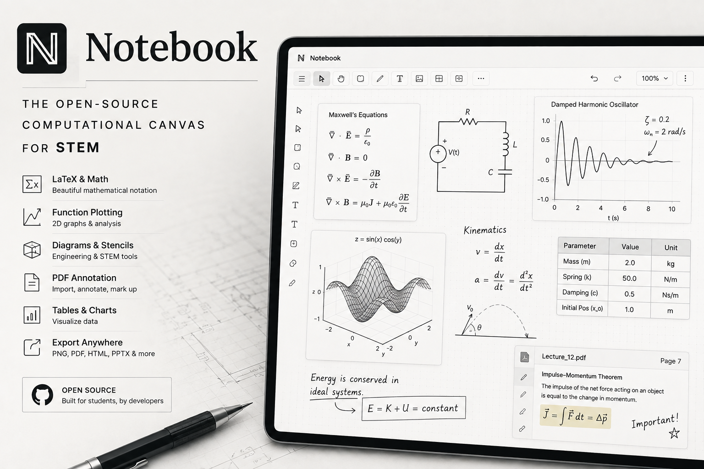

# Notebook



**An engineer's notebook — a drafting table for STEM.**
Sketch system architectures and blueprints, annotate PDFs, plot functions, and
drop in publication-quality **LaTeX math, physics, and chemistry** right next to
your diagrams. Local-first and open source: every file is an infinite canvas that
autosaves to a database on your own machine.

 · .NET 10 · Next.js 16 · SQLite

> **Status:** working prototype. Single-user, local-first, no accounts.
> See [CONTRIBUTING.md](CONTRIBUTING.md) for the roadmap (graphing calculator,
> 2D chemistry structures, auto-layout figures, C++ physics simulations).

---

## Highlights

- **Infinite canvas** — scroll/pan (two-finger scroll, the Pan tool, or hold
  **Space**) and zoom (**Ctrl/⌘ + scroll** or pinch, plus the on-canvas zoom HUD).
- **Notebook paper** — blank, **grid**, **ruled lines**, or **dots**, in any paper colour.
- **Draw** — pen, eraser, line, arrow, rectangle, ellipse, diamond, triangle, text.
  Everything is movable and freely resizable (including text size).
- **LaTeX math / physics / chemistry** — a live-preview editor with a symbol
  palette. Handles `E = mc^2`, matrices, `G:\mathbb{R}^n\to[0,1]`, and — via
  mhchem — nuclear and chemical equations like
  `\ce{^{6}_{3}Li + ^{1}_{0}n -> ^{3}_{1}H + ^{4}_{2}He}`.
- **Function grapher** — a Desmos-style tool: plot one or more `y = f(x)` with a
  live preview and adjustable range (its own dependency-free expression engine).
- **Tables & charts** — structured data, edited in a dialog, rendered as crisp
  vector graphics. Charts: bar, line, area, scatter, pie.
- **Stencils & templates** — drag-in system-architecture / circuit / blueprint
  symbols, and one-click starter diagrams (system architecture, neural network,
  blueprint sheet).
- **Snap-to-grid** and a **selection panel** to resize/restyle any placed object.
- **Files & folders** — a collapsible tree; drag a file onto a folder to move it.
- **Undo / redo**, and debounced **autosave** to SQLite.
- **Import** PNG/JPG, **PDF** (each page becomes an annotatable image), and
  `.notebook` scenes. **Export** PNG, JPG, PDF, HTML, PowerPoint (`.pptx`), or
  the raw scene — everything on the canvas exports together.

Word/Excel export is intentionally omitted — a freeform canvas doesn't map onto
their document models. Use PDF, PPTX, or an image instead.

## Stack

| Layer     | Tech                                              |
|-----------|---------------------------------------------------|
| Backend   | ASP.NET Core Web API (.NET 10) + EF Core          |
| Database  | **SQLite** — one file (`backend/notebook.db`)     |
| Frontend  | Next.js (App Router, TypeScript)                  |
| Canvas    | **Konva** / react-konva (vector scene graph)      |
| Math      | **MathJax** (LaTeX → SVG) with the `mhchem` package |
| Export    | jsPDF, pptxgenjs, pdf.js (all lazy-loaded)        |

## Quick start

Prerequisites: **.NET 10 SDK** and **Node 18+**. Two terminals:

**Backend** — http://localhost:5199 (the SQLite file is created on first run):

```bash
cd backend && ASPNETCORE_URLS="http://localhost:5199" dotnet run
```

**Frontend** — http://localhost:3000:

```bash
cd frontend && cp .env.example .env.local && npm install && npm run dev
```

Then open http://localhost:3000. `NEXT_PUBLIC_API_URL` (in `.env.local`) points
the frontend at the API; the API allows CORS from `localhost:3000`.

## Architecture

Each canvas is a **vector scene** — a JSON document of typed elements
(`stroke`, `arrow`, `rect`, `math`, `table`, `chart`, …) plus a paper style —
stored in one `SceneJson` column. This keeps elements re-editable, makes saves
tiny diffs, and lets any export just render the scene.

- **Frontend** is the source of truth for element shapes (`src/lib/types.ts`).
  Adding a drawing capability is usually a new element `type` + a renderer — no
  database migration.
- **Backend** models the same schema as typed DTOs (`Dtos/SceneDto.cs`) and
  **validates** each known element on save, while **tolerating unknown/newer
  types** (kept intact via JSON extension data) so the frontend can evolve
  without breaking the API. The raw JSON is stored verbatim, so nothing is ever
  dropped on round-trip.

```
backend/    ASP.NET Core API — Models/, Data/, Dtos/, Controllers/
frontend/   Next.js
  src/components/  Editor, DrawingCanvas, Toolbar, Sidebar, *Modal
  src/lib/         types, api, math (MathJax), generate (SVG), exporters
```

## API

| Method | Route                     | Purpose                          |
|--------|---------------------------|----------------------------------|
| GET    | `/api/files`              | List files (metadata only)       |
| GET    | `/api/files/{id}`         | Open a file (includes scene)     |
| POST   | `/api/files`              | Create a file                    |
| PUT    | `/api/files/{id}`         | Autosave (name / background / scene) |
| PATCH  | `/api/files/{id}/move`    | Move to a folder / to root       |
| DELETE | `/api/files/{id}`         | Delete a file                    |
| CRUD   | `/api/folders`            | Folder create / rename / delete  |

## Contributing

Contributions are very welcome — especially features real STEM workflows need.
Start with [CONTRIBUTING.md](CONTRIBUTING.md): it has the tiered roadmap, the
"how to add an element type" walkthrough, and a list of unmet needs by field
(CS, EE, ME, physics, chemistry, math, bio). Before a PR, make sure
`cd frontend && npm run build` and `cd backend && dotnet build` both pass.

## License

[MIT](LICENSE) © Nursan Omarov and Notebook contributors.
